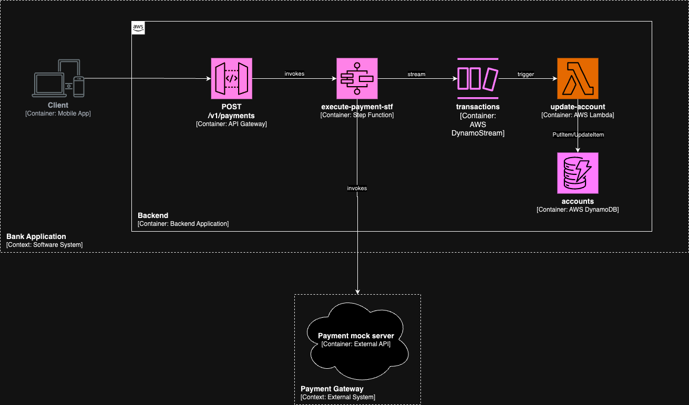
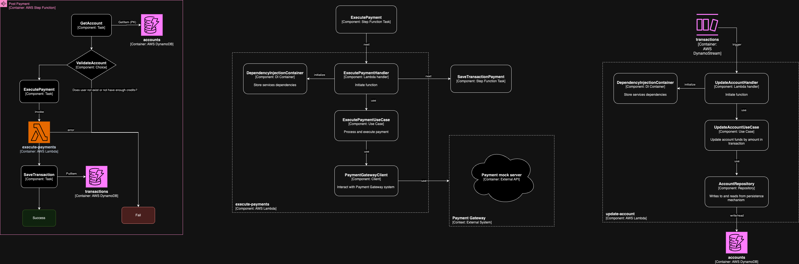

# Reto técnico iO - Backend

## Descripción:
Se requiere implementar un sistema el cual simule el abono de saldo a una cuenta y su posterios consulta. A continuación se muestran los diagramas correspondientes:


### Funcionalidad de abono
#### Contexto

#### Contenedores

#### Componentes



Este API debe de llamar a un Step Function el cual debe:
- Validar el id de usuario comparándolo en la tabla **users**
- En caso el usuario exista, un lambda llamado **execute-payment** debe llamar a un API Mock que el postulante debe crear, el cual debe de regresar una transacción exitosa a modo de evento.
- Si la transacción es exitosa, como una siguiente tarea en el Step Function, debe de grabarse un registro en la tabla **transactions**
- De forma asincrona, por medio de DynamoDB Streams, se debe ejecutar un lambda llamado **update-account**, el cual actualizara el saldo de la cuenta a la que se realizo el abono en la tabla **accounts**.
- Al terminar todo de forma exitosa, debe dar una respuesta satisfactoria que contenga el id (source) de la transacción.

---

### Funcionalidad de consulta de cuenta
#### Contexto

#### Contenedores

#### Componentes


Este API debe de llamar a un Lambda Function la cual debe:
- Consultar por id a la tabla **accounts**
- En caso la cuenta exista, debe de regresar el registro.
- En caso la cuenta no exista, debe de regresar una respuesta con el mensaje "Cuenta no encontrada"

## Consideraciones:

### Datos de pruebas (IMPORTANTE):

Ya que no se contara con un servicio para crear las cuentas, estas deberan de ser creadas manualmente en DynamoDB.


### Obligatorio : 
1. Respetar el arquetipo 
2. Construir pruebas unitarias
3. Buenas Prácticas (SOLID, Clean Code, etc)

### Deseable: 
1. Crear los componentes con IaC (Terraform, Cloudformation)
2. Logs usando CloudWatch
3. Formatters / Linters

## Anexos:

### Accounts (DynamoDB Table)
- PK: id (S)


### Transaction (DynamoDB Table)
- PK: source (S)
- SK: id (N)

### Account (Model)
```
{
    "id": "{uuid}",
    "amount": "{number}"
}
```

### Transaction (Model)
```
{
    "source": "{uuid}",
    "id": "{id}",
    "data": {
        "accountId": "{id}",
        "amount": "{number}"
    }
}
```

### POST /v1/payments

Payload
```
{
    "accountId": "f529177d-0521-414e-acd9-6ac840549e97",
    "amount": 30
}
```

Respusta OK (201)
```
{
    "message": "Payment registered successfully",
    "transactionId": "8db0a6fc-ad42-4974-ac1f-36bb90730afe"
}
```

Respuesta errada (400)
```
{
    "message": "Something was wrong"
}
```

### GET /v1/accounts/{accountId}

Path Params
```
accountId: "8db0a6fc-ad42-4974-ac1f-36bb90730afe"
```

Respusta OK (200)
```
{
    "id": "8db0a6fc-ad42-4974-ac1f-36bb90730afe",
    "amount": "30",
}
```

Respuesta errada (404)
```
{
    "message": "Account not found"
}
```


## Send us your challenge
Cuando termines el reto, luego de forkear el repositorio, debes crear un pull request to our repository indicando en la descripción de este tu nombre y correo.

### Tiempo de resolución: 3 días

# Datos del Proyecto

## Arquitectura
Este proyecto sigue los principios de Arquitectura Limpia para asegurar una estructura modular y escalable. La arquitectura se basa en separar las responsabilidades en diferentes capas, cada una con sus propias responsabilidades, para mejorar la mantenibilidad y escalabilidad del sistema.

## Endpoints de prueba:
- Get-Transactions
```json
Curl:
curl --location 'https://9yp31ebze1.execute-api.us-east-1.amazonaws.com/dev/v1/transactions?transaction_id=8db0a6fc-ad42-4974-ac1f-36bb90730afe'
```
```json
Response:
{
"message": "Transaction not found",
"transactionId": "8db0a6fc-ad42-4974-ac1f-36bb90730afe"
}
```
- Mock-Transaction
```json
curl --location 'https://9yp31ebze1.execute-api.us-east-1.amazonaws.com/dev/mock-transaction' \
--header 'Content-Type: application/json' \
--data '{
    "userId" : "2222222"
}'
```
```json
Response:
{
"userId": "2222222",
"transactionId": "09a9c5ec-71ad-4692-9032-24d364118f71",
"status": "success"
}
```

- Excecute Payments
```json
curl --location 'https://9yp31ebze1.execute-api.us-east-1.amazonaws.com/dev/v1/payments' \
--header 'Content-Type: application/json' \
--data '{
    "userId": "15f1c60a-2833-49b7-8660-065b58be2f89"
}'
```
Response:
```json
{
    "billingDetails": {
        "billedDurationInMilliseconds": 200,
        "billedMemoryUsedInMB": 64
    },
    "executionArn": "arn:aws:states:us-east-1:922367397130:express:bcp_challenged_io_backend:4356725e-e3fb-49bc-b99d-9db7095cc881:dba255ef-e8fe-40bc-8ef4-1a9a628c5dd4",
    "input": "{\n    \"userId\": \"15f1c60a-2833-49b7-8660-065b58be2f89\"\n}",
    "inputDetails": {
        "__type": "com.amazonaws.swf.base.model#CloudWatchEventsExecutionDataDetails",
        "included": true
    },
    "name": "4356725e-e3fb-49bc-b99d-9db7095cc881",
    "output": "{}",
    "outputDetails": {
        "__type": "com.amazonaws.swf.base.model#CloudWatchEventsExecutionDataDetails",
        "included": true
    },
    "startDate": 1.72170984853E9,
    "stateMachineArn": "arn:aws:states:us-east-1:922367397130:stateMachine:bcp_challenged_io_backend",
    "status": "SUCCEEDED",
    "stopDate": 1.721709848725E9
}
```

## Inicio Rapido
```shell
make all
```
