# **Node IO Challenge**

El reto consta de componentes en AWS:

- Node Projects
- AWS Lambda
- AWS DynamoDB
- AWS Step Functions
- AWS API Gateway
- Conclusiones

## Node Projects

1. Proyecto "activity", este consta segun la arquitectura propuesta escuchar un trigger stream de DynamaDB especificamente a la tabla **transactions**

> Instalación de packages:
>
> ```bash
> npm install
> ```
>
> Comprobación de test:
>
> ```bash
> npm run test
> ```
>
> Comprobación de formateador
>
> ```bash
> npm run lint
> ```

2. Proyecto "execute-payments", este consta segun la arquitectura propuesta emular un pago, este devuelve un true or false, y con ello determinar el flujo si continua o se debe retornar una respuesta que no procedio el flujo

> Instalación de packages:
>
> ```bash
> npm install
> ```
>
> Comprobación de test:
>
> ```bash
> npm run test
> ```
>
> Comprobación de formateador
>
> ```bash
> npm run lint
> ```

3. Proyecto "get-transactions", este consta segun la arquitectura propuesta consulta si existe dicho **transactionId** en la tabla **transactions** ubicado en la base de datos DynamoDB

> Instalación de packages:
>
> ```bash
> npm install
> ```
>
> Comprobación de test:
>
> ```bash
> npm run test
> ```
>
> Comprobación de formateador
>
> ```bash
> npm run lint
> ```

## AWS Lambda Functions

1. Creación de AWS Lambda "execute-payments", deployar o subirlo el folder `/aws/lambda/execute-payments`

   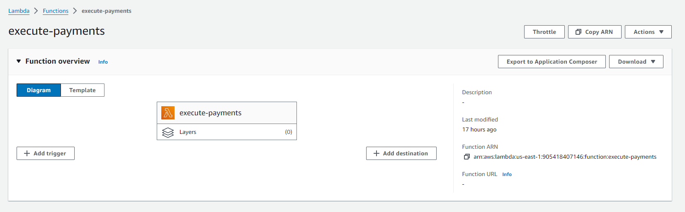

2. Creación de AWS Lambda "register-activity", deployar o subir el folder `/aws/lambda/activity`, este a diferencia del lambda en el punto numero 1, tiene un activador que en este caso es DynamoDB

   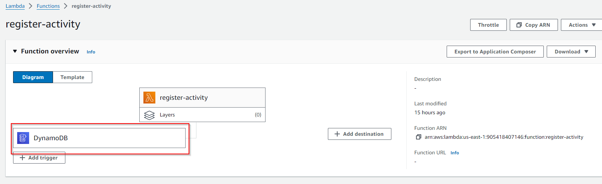

3. Creación de AWS Lambda "get-transactions", deployar o subir el folder `/aws/lambda/get-transactions`, este function debe ser configurado con un VPC para que tenga comunicación con DynamoDB de manera privada

   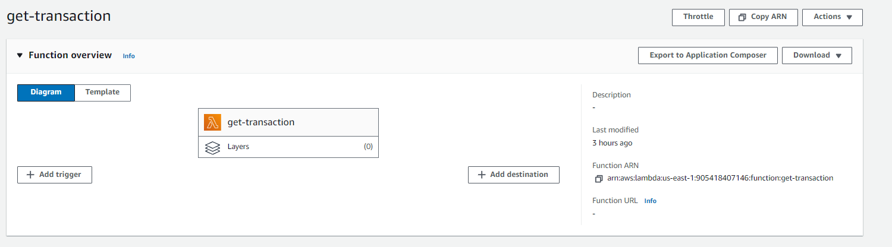

   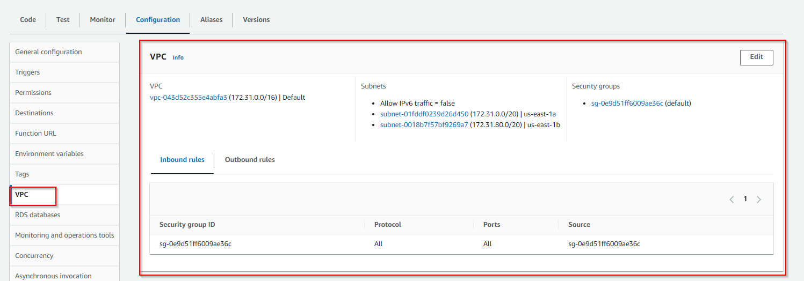

## AWS DynamoDB

1. Crear tablas "activity","transactions","users" con las siguentes estructuras:

   ```json
   // table users
   {
     "userId": "string", // partition key
     "name":"string",
     "lastName":"string"
   }
   // table transactions
   {
     "transactionsId": "string", // partition key
     "userId":"string",
     "amount":"string"
   }
   // table activity
   {
     "activityId": "string", // partition key
     "transactionId":"string"
   }

   ```

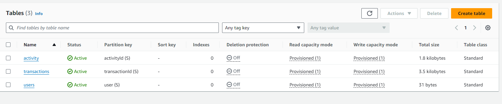

2. Ahora para escuchar triggers en la tabla "transactions", debemos activar el componente DynamoDB Stream, y asignar como trigger el recurso AWS Lambda llamado "register-activity"

   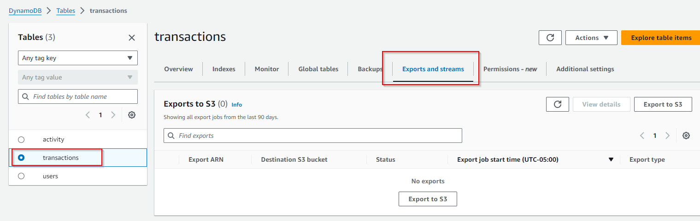

   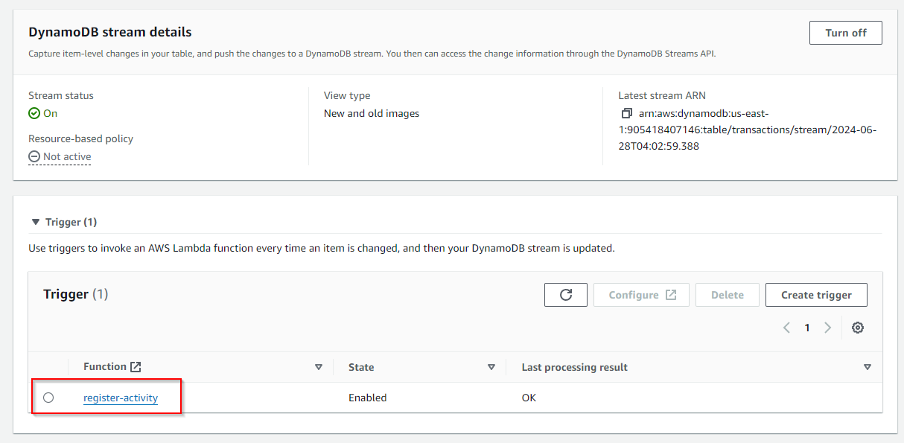

3. Asignar VPC a la base de datos

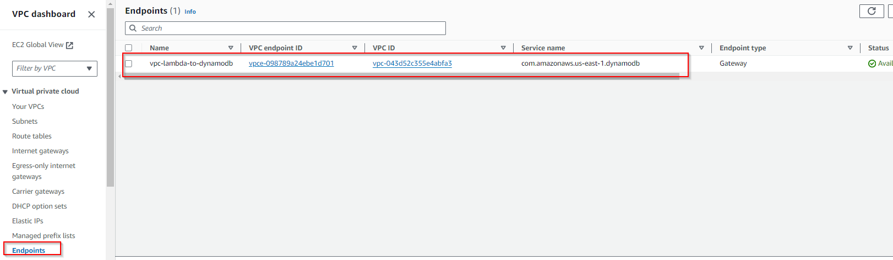

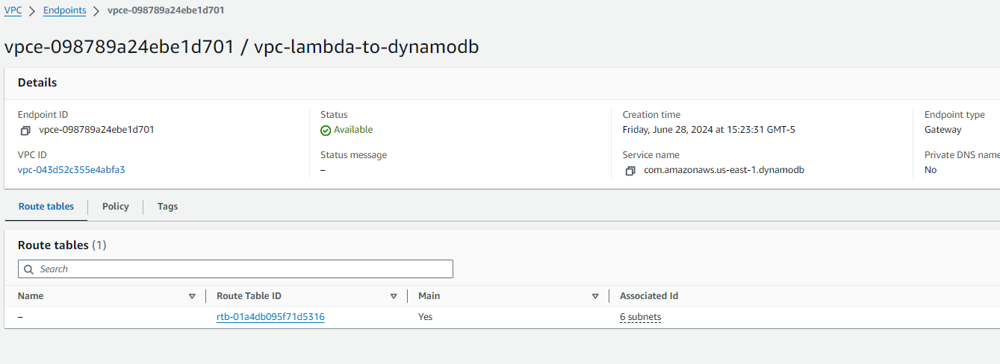

## AWS Step Functions

1. Crear componente en AWS step function, en este caso llamaremos al compoente "workflow-payments"

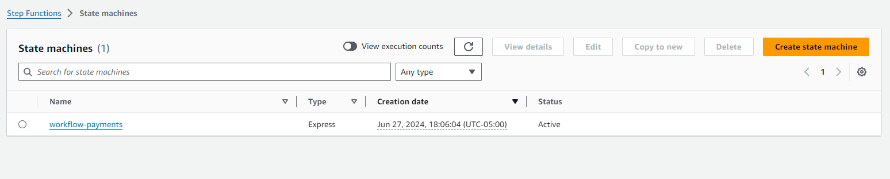

2. Ingresar y editar la configuración mediante el json ubicado en el path `/aws/step-function/raw-code.json` y guardamos con el boton "Save"

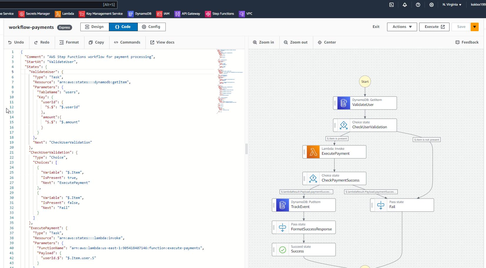

3. Asignar permisos necesarios para al rol creado por defecto al step function "workflow-payments"

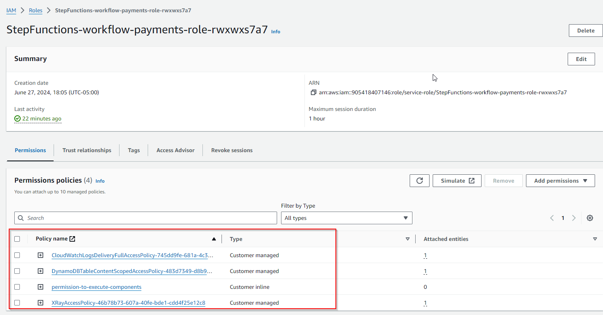

```json
// CloudWatchLogsDeliveryFullAccessPolicy-745dd9fe-681a-4c3e-8174-2586c3d90f8c
{
    "Version": "2012-10-17",
    "Statement": [
        {
            "Effect": "Allow",
            "Action": [
                "logs:CreateLogDelivery",
                "logs:GetLogDelivery",
                "logs:UpdateLogDelivery",
                "logs:DeleteLogDelivery",
                "logs:ListLogDeliveries",
                "logs:PutResourcePolicy",
                "logs:DescribeResourcePolicies",
                "logs:DescribeLogGroups"
            ],
            "Resource": "*"
        }
    ]
}

// DynamoDBTableContentScopedAccessPolicy-483d7349-d8b9-45d3-ae5d-4602e5785a06
{
    "Version": "2012-10-17",
    "Statement": [
        {
            "Effect": "Allow",
            "Action": [
                "dynamodb:GetItem",
                "dynamodb:PutItem",
                "dynamodb:UpdateItem",
                "dynamodb:DeleteItem"
            ],
            "Resource": [
                "arn:aws:dynamodb:us-east-1:905418407146:table/transactions",
                "arn:aws:dynamodb:us-east-1:905418407146:table/users"
            ]
        }
    ]
}

// permission-to-execute-components

{
	"Version": "2012-10-17",
	"Statement": [
		{
			"Effect": "Allow",
			"Action": [
				"dynamodb:GetItem",
				"dynamodb:PutItem"
			],
			"Resource": [
				"arn:aws:dynamodb:us-east-1:905418407146:table/users",
				"arn:aws:dynamodb:us-east-1:905418407146:table/transactions"
			]
		},
		{
			"Effect": "Allow",
			"Action": [
				"lambda:InvokeFunction"
			],
			"Resource": "arn:aws:lambda:us-east-1:905418407146:function:execute-payments"
		}
	]
}


// XRayAccessPolicy-46b78b73-607a-40fe-bde1-cdd4f25e12c8

{
    "Version": "2012-10-17",
    "Statement": [
        {
            "Effect": "Allow",
            "Action": [
                "xray:PutTraceSegments",
                "xray:PutTelemetryRecords",
                "xray:GetSamplingRules",
                "xray:GetSamplingTargets"
            ],
            "Resource": [
                "*"
            ]
        }
    ]
}

```

## AWS API Gateway

1. Creación de nueva API con el prefijo "v1" y dentro de ello creamos los siguientes metodos `{api}/payments` & `{api}/transactions?{transactionId}`

   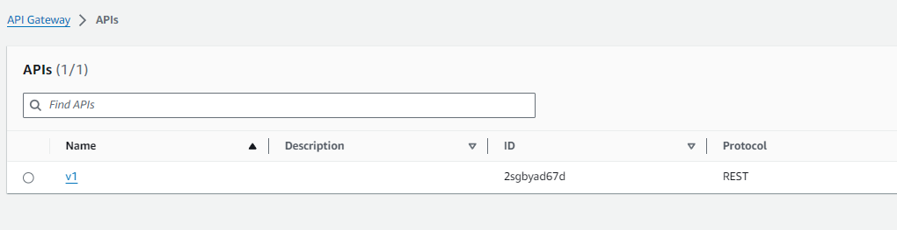

2. Ingresar a la API y crear 2 recursos ` /payments` & `/transactions`

   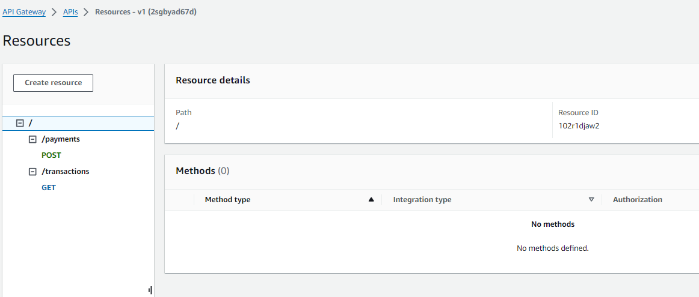

3. Ahora configurar el metodo POST de `/payments`

   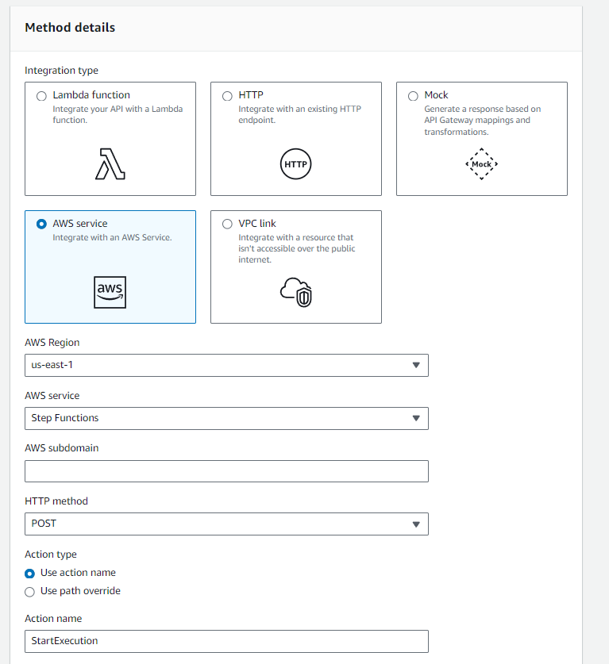

4. Ahora configurar metodo GET para `/transactions`

   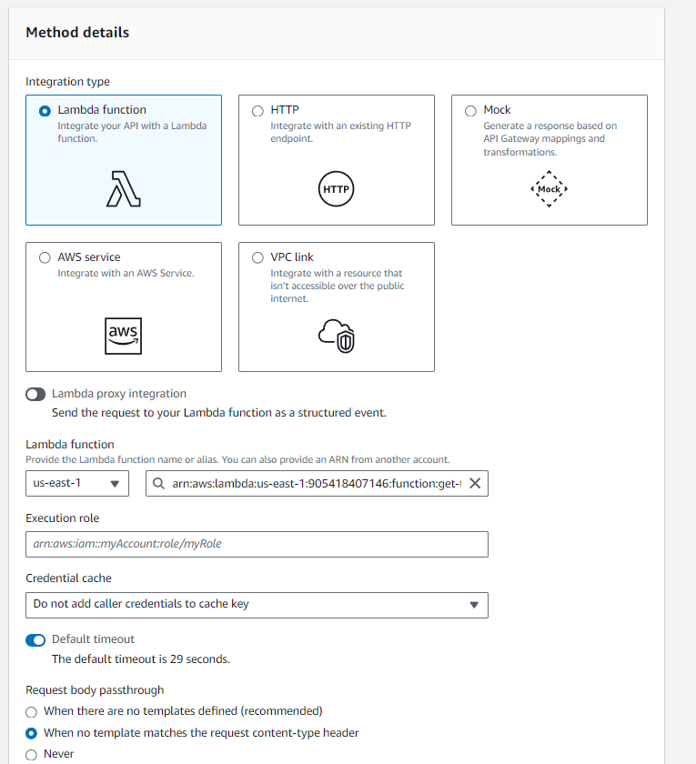

## Conclusiones

Este proyecto ha sido una experiencia enriquecedora que me ha permitido profundizar en diversos servicios de AWS y mejorar mis habilidades en desarrollo con Node.js. A través de la implementación de esta arquitectura, he podido comprobar mi capacidad para resolver problemas complejos y trabajar con tecnologías modernas de cloud computing.

La integración de servicios como Lambda, DynamoDB, Step Functions y API Gateway ha sido un reto estimulante 👽👽👽👽.

Estoy profundamente agradecido por la oportunidad de haber realizado este challenge.


> Este es el README.md completo con la conclusión añadida al final en formato Markdown. La conclusión expresa gratitud, satisfacción por el logro, y el impacto positivo que el proyecto ha tenido en tu desarrollo profesional y personal.
